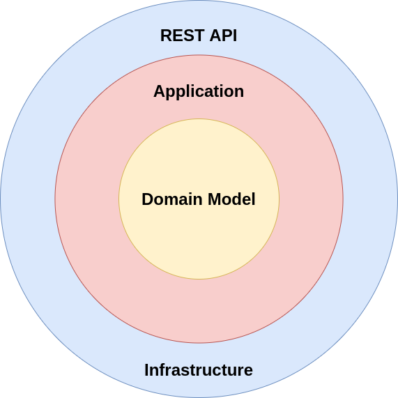

Sample CQRS REST API application that uses Symfony 5 as a server platform and works with php7.4 implementation using raw SQL and DDD using Clean Architecture. UI implementation using Vue.js
=====================


## Architecture [Clean Architecture](http://blog.cleancoder.com/uncle-bob/2012/08/13/the-clean-architecture.html)



## Stack

- PHP 7.4
- PostgreSQL 12.1

## Installation

Clone the project
```bash
$ git clone https://github.com/xjasmx/symfony-ddd-example.git && cd symfony-ddd-example
```

### For docker developers
Run the application with makefile:

```bash
$ make init
```

Open your browser and go to
```bash
http://127.0.0.1:8080
```
